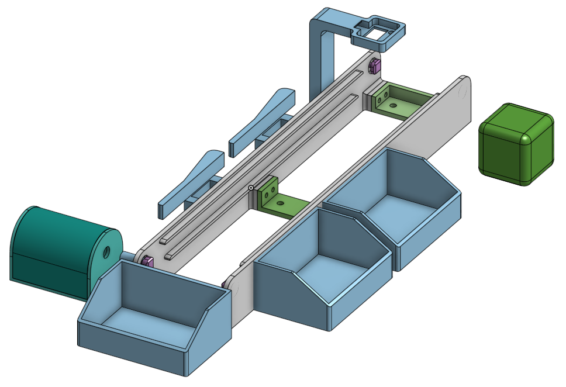
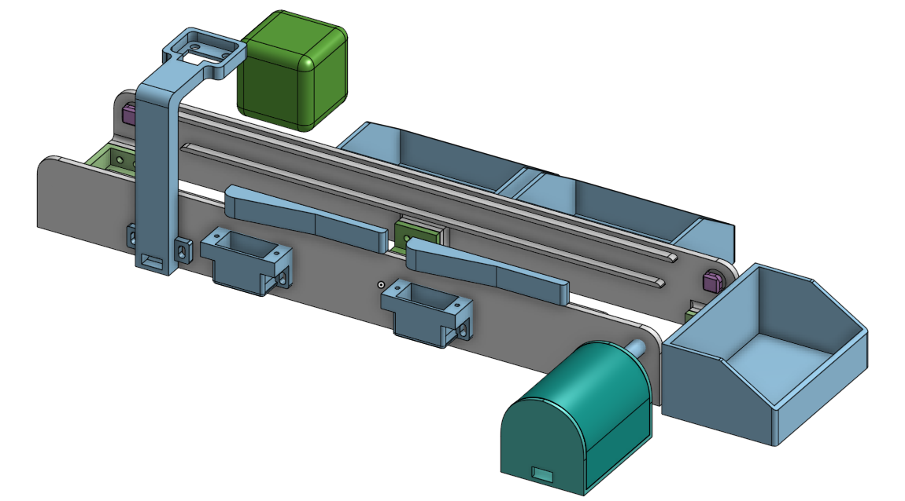

# Industrial Demo — 10BASE-T1L Control Network

Industrial control network demo using Analog Devices 10BASE-T1L Single Pair Ethernet. A Raspberry Pi running Kuiper Linux 2 acts as the central controller, communicating with multiple ADI evaluation boards over T1L to drive servomotors, control an LED, read temperatures, and drive a DC fan — all managed from a single Python GUI.

## Mechanical Design

<table>
  <tr>
    <td></td>
    <td></td>
  </tr>
</table>

### Bill of Materials (BOM)

| Part                     | Description                                                                                          | Part No.                  | Qty   | Vendor                                                                                                                              | Filament (g)       |
| ------------------------ | ---------------------------------------------------------------------------------------------------- | ------------------------- | ----- | ----------------------------------------------------------------------------------------------------------------------------------- | ------------------ |
| Roller bearing           | Deep groove ball bearing, 3×10×4 mm, double-shielded                                               | SKF 623-2Z                | 4     | [TME](https://www.tme.eu/en/details/skf623-2z/roller-bearings/skf/623-2z-skf/)                                                       | —                 |
| DC gearmotor             | 195:1 metal gearmotor, 20D×44L mm, 6V                                                               | Pololu 3707               | 1     | [TME](https://www.tme.eu/en/details/pololu-3707/dc-motors/pololu/195-1-metal-gearmotor-20dx44l-mm-6v-cb/)                            | —                 |
| Color sensor             | Analog color sensor (colorimeter)                                                                    | DFRobot SEN0212           | 1     | [TME](https://www.tme.eu/ro/details/df-sen0212/senzori-de-mediu/dfrobot/sen0212/)                                                    | —                 |
| Accelerometer eval board | Low noise, low drift 3-axis accelerometer, PMOD board                                                | EVAL-ADXL355-PMDZ         | 1     | [Analog Devices](https://www.analog.com/en/resources/evaluation-hardware-and-software/evaluation-boards-kits/eval-adxl355-pmdz.html) | —                 |
| Threaded insert          | Brass threaded insert for plastic parts (used with the 14 M3 screws below)                           | Tappex KVT-M3 (KVT-117M3) | 14    | [TME](https://www.tme.eu/ro/details/kvt-117m3/inserturi-filetate/tappex/117m3/)                                                      | —                 |
| M3 screw                 | For the threaded inserts above                                                                       | Generic M3                | 10    | —                                                                                                                                  | —                 |
| M3 screw                 | For servo / color sensor / ADXL355 holder mounting (paired with nut below)                           | Generic M3                | 14    | —                                                                                                                                  | —                 |
| M3 nut                   | Paired with the 14 holder-mounting screws above                                                      | Generic M3                | 14    | —                                                                                                                                  | —                 |
| 3D-printed parts         | Chassis, holders, connectors — see[`CAD/parts`](CAD/parts/) and [`CAD/printable`](CAD/printable/) | Custom                    | 1 set | In-house (3D print)                                                                                                                 | ~700 (PLA or PETG) |

### CAD Files

CAD files are in [`CAD/`](CAD/):

- `CAD/assembly/` — full assembly (STEP)
- `CAD/parts/` — individual custom parts (STEP), named by part number
- `CAD/printable/` — 3D-printable parts (3MF)

### Build Steps

1. 3D-print all parts.
2. Heat-set the threaded inserts into the `side` part using a soldering iron.
3. Assemble the side panels using the connectors and screws into the inserts.
4. Drill holes in the side panel at the locations where the servo holder and color sensor holder will be mounted.
5. Mount the hardware into its holders (servo into its holder, DC motor into its case, color sensor into its housing, etc.).
6. Mount the housings with the hardware onto the side panel at the drilled holes, using M3 screws and nuts.
7. Insert the connectors into the bearing bores and each bearing into its position. Note that one bearing uses the elongated connector, which mates with the longer connector going into the motor's connecting shaft. In this step also fit the bearings into the side panel, with the belt driveshaft connecting through the bearing.
8. Attach the motor housing to the side panel using the heat-set inserts and M3 screws, leaving a small amount of play so the shafts self-align horizontally.
9. Check that the overall structure is rigid and that all screws are fully tightened.
10. Finally, position the conveyor belt and assemble it using the 3D-printed pins together with the belt.
11. *(Optional)* The `side` part and the `box` parts are designed with an internal empty cavity for embedding magnets — two 10×2 mm magnets in `side` and two 10×1 mm magnets in `box`. Mind the polarity so the two parts attract each other once assembled. To embed them, use a 3D-print slicer that supports pausing the print at a given layer/height: pause at the last layer of the cavity, place the magnet, then resume the print.

## Hardware

| Board                                                                                                                                                                                                                                                                        | Description                                                                      | IP Address    |
| ---------------------------------------------------------------------------------------------------------------------------------------------------------------------------------------------------------------------------------------------------------------------------- | -------------------------------------------------------------------------------- | ------------- |
| Raspberry Pi 4 + [AD-RPI-T1LPSE-SL](https://www.analog.com/en/resources/evaluation-hardware-and-software/evaluation-boards-kits/ad-rpi-t1lpse-sl.html)                                                                                                                         | Main controller — runs the GUI, acts as TCP client and SPoE PSE                 | 192.168.98.1  |
| [AD-APARD32690-SL](https://www.analog.com/en/resources/evaluation-hardware-and-software/evaluation-boards-kits/ad-apard32690-sl.html) #1 + [AD-APARDPFWD-SL](https://www.analog.com/en/resources/evaluation-hardware-and-software/evaluation-boards-kits/ad-apardpfw-sl.html)  | APARD #1 — MAX32690 MCU with ADIN2111 (dual-port T1L MAC-PHY)                    | 192.168.98.50 |
| [AD-APARD32690-SL](https://www.analog.com/en/resources/evaluation-hardware-and-software/evaluation-boards-kits/ad-apard32690-sl.html) #2 + [AD-APARDSPOE-SL](https://www.analog.com/en/resources/evaluation-hardware-and-software/evaluation-boards-kits/ad-apardspoe-sl.html) | APARD #2 — MAX32690 MCU with ADIN1110 (single-port T1L MAC-PHY)                  | 192.168.98.60 |
| Raspberry Pi 4 + [EVAL-CN0575-RPIZ](https://analogdevicesinc.github.io/documentation/solutions/reference-designs/eval-cn0575-rpiz/index.html)                                                                                                                                  | CN0575 — ADT75 temperature sensor and ADXL355 over T1L                          | 192.168.10.2  |
| [AD-T1LUSB-EBZ](https://analogdevicesinc.github.io/documentation/solutions/reference-designs/ad-apard32690-sl/ad-t1lusb-ebz/index.html)                                                                                                                                       | USB-to-T1L adapter — plugged into a USB port on the main RPi                    | —            |
| [EVAL-AD-SWIOT1L-SL](https://www.analog.com/en/resources/evaluation-hardware-and-software/evaluation-boards-kits/ad-swiot1l-sl.html)                                                                                                                                          | SWIOT1L — MAX14906 digital output + AD74413R analog I/O (independently powered) | 192.168.97.40 |

### Additional Components

- 2x servomotors connected to APARD #1 (driven over TMR1 and TMR2 pins)
- 1x LED + 330 ohm resistor on APARD #2 (wired to P2.7 / GPIO_2 on header P7)
- DC fan connected to SWIOT1L MAX14906 channel 0 (digital output for PWM)
- EVAL-ADXL355-PMDZ connected on SPI1 of the Raspberry Pi 4 + CN0575
- Single Pair Ethernet cables (T1L) between Main RPi, APARD #1, APARD #2, and CN0575
- SWIOT1L connects to the main RPi via the AD-T1LUSB-EBZ USB-to-T1L adapter (not directly through the T1LPSE)
- USB cables for flashing APARD boards via DAPLINK
- MaxDAP Pico programmer for OpenOCD flashing

## Network Topology


## Software and Firmware

### Operating Systems

| Target            | OS / Framework                                                                                      |
| ----------------- | --------------------------------------------------------------------------------------------------- |
| Main RPi (T1LPSE) | [ADI Kuiper Linux 2.0](https://wiki.analog.com/resources/tools-software/linux-software/kuiper-linux) |
| CN0575 RPi        | [ADI Kuiper Linux 2.0](https://wiki.analog.com/resources/tools-software/linux-software/kuiper-linux) |
| APARD #1 and #2   | [no-OS](https://github.com/analogdevicesinc/no-OS) bare-metal C (MAX32690)                           |
| SWIOT1L           | [no-OS](https://github.com/analogdevicesinc/no-OS) bare-metal C (MAX32650)                           |

### Python Dependencies (Main RPi)

```
matplotlib
pyadi-iio
```

## Setup Guide

### Phase 1 — System Verification

#### Build a Custom Kuiper Image for the AD-RPI-T1LPSE-SL

Clone the ADI Kuiper repository on a build machine (not the target RPi) using the branch specific to the AD-RPI-T1LPSE-SL:

```bash
git clone --depth 1 --branch kuiper-AD-RPI-T1LPSE-SL https://github.com/analogdevicesinc/kuiper
cd kuiper
sudo ./build-docker.sh
```

For full build options see the [Kuiper Quick Start](https://wiki.analog.com/resources/tools-software/linux-software/kuiper-linux). Once the image is built, write it to a micro-SD card and boot the Raspberry Pi.

#### Configure the SD Card for ADI-RPI-T1LPSE-SL

The Linux kernel requires a device tree overlay to identify the AD-RPI-T1LPSE-SL hardware. The overlay is included in Kuiper and only needs to be enabled. Add the following line to `/boot/config.txt`:

```
dtoverlay=rpi-t1lpse-class12
```

Place this line under the `[Pi4]` section for Raspberry Pi 4, or under `[Pi5]` for Raspberry Pi 5.

```

After reboot, confirm the overlay is loaded:

```bash
dtoverlay -l | grep t1lpse
```

#### Configure the SD Card for CN0575

To use the EVAL-CN0575-RPIZ with the Raspberry Pi, the micro-SD card should be preloaded with [Kuiper Linux](https://wiki.analog.com/resources/tools-software/linux-software/kuiper-linux).

Complete instructions, including where to download the SD card image, how to write it to the micro-SD card, and how to configure the system are provided at the [Kuiper page](https://wiki.analog.com/resources/tools-software/linux-software/kuiper-linux).

#### Enable the CN0575 + ADXL355 Overlay

The `rpi-cn0575-adxl355-overlay` is a custom overlay (not part of the standard Kuiper or Raspberry Pi overlay set). It must be compiled from source and installed manually before it can be enabled.

Compile the overlay on the CN0575 Raspberry Pi:

```bash
dtc -@ -I dts -O dtb -o rpi-cn0575-adxl355-overlay.dtbo RPI_CN0575/rpi-cn0575-adxl355-overlay.dts
sudo cp rpi-cn0575-adxl355-overlay.dtbo /boot/overlays/
```

Add the following line to `/boot/config.txt`:

```
dtoverlay=rpi-cn0575-adxl355-overlay
```

Reboot and confirm the overlay is loaded:

```bash
dtoverlay -l | grep cn0575-adxl
```

### Phase 2 — Install Prerequisites

Install build tools, libraries, and SDKs on the main RPi.

#### Build Tools and ARM Toolchain

```bash
sudo apt update
sudo apt install -y git make gcc-arm-none-eabi libnewlib-arm-none-eabi
```

Verify the installation:

```bash
arm-none-eabi-gcc --version
make --version | head -1
git --version
```

#### MaximSDK (headers and libraries only)

```bash
git clone https://github.com/analogdevicesinc/msdk.git ~/MaximSDK
```

Create a GNUTools symlink so the no-OS build system finds the system compiler:

```bash
mkdir -p ~/MaximSDK/Tools/GNUTools/10.3/bin
ln -s /usr/bin/arm-none-eabi-* ~/MaximSDK/Tools/GNUTools/10.3/bin/
```

Add the environment variable to `~/.bashrc`:

```bash
echo 'export MAXIM_LIBRARIES=~/MaximSDK/Libraries' >> ~/.bashrc
source ~/.bashrc
```

#### no-OS

Clone the fork with the APARD LED control examples:

```bash
git clone --recursive https://github.com/GanscaTudor/no-OS.git --branch industrial-demo ~/no-OS
```

This branch contains two projects used in the demo:

- `projects/apardpfwd` — apard_servo_control example for APARD #1 (ADIN2111 / PFWD shield) — the firmware must expose `SERVO1_ON`, `SERVO1_OFF`, `SERVO2_ON`, `SERVO2_OFF`, `SERVO_STATUS` over TCP port 10000
- `projects/apardspoe` — `apardspoe_led_control_example` for APARD #2 (ADIN1110 / SPOE shield)

Append the required peripheral driver sources to each project's build file:

```bash
cat >> ~/no-OS/projects/apardpfwd/src.mk << 'EOF'

SRCS += $(MAXIM_LIBRARIES)/PeriphDrivers/Source/SYS/mxc_delay.c \
        $(MAXIM_LIBRARIES)/PeriphDrivers/Source/SYS/mxc_lock.c

INCS += $(MAXIM_LIBRARIES)/PeriphDrivers/Include/MAX32690/mxc_delay.h \
        $(MAXIM_LIBRARIES)/PeriphDrivers/Include/MAX32690/mxc_lock.h
EOF

cat >> ~/no-OS/projects/apardspoe/src.mk << 'EOF'

SRCS += $(MAXIM_LIBRARIES)/PeriphDrivers/Source/SYS/mxc_delay.c \
        $(MAXIM_LIBRARIES)/PeriphDrivers/Source/SYS/mxc_lock.c

INCS += $(MAXIM_LIBRARIES)/PeriphDrivers/Include/MAX32690/mxc_delay.h \
        $(MAXIM_LIBRARIES)/PeriphDrivers/Include/MAX32690/mxc_lock.h
EOF
```

#### libiio (v0 branch)

```bash
sudo apt-get install -y libxml2 libxml2-dev bison flex libcdk5-dev cmake \
    libaio-dev libusb-1.0-0-dev libserialport-dev libavahi-client-dev

git clone https://github.com/analogdevicesinc/libiio.git --branch libiio-v0 ~/libiio
cd ~/libiio && mkdir build && cd build
cmake .. -DPYTHON_BINDINGS=ON
make -j && sudo make install
sudo ldconfig
```

#### pyadi-iio

```bash
sudo apt-get install -y python3 libatlas-base-dev
git clone https://github.com/analogdevicesinc/pyadi-iio ~/pyadi-iio
cd ~/pyadi-iio
sudo python3 -m pip install -r requirements_prod_test.txt
sudo pip install .
```

#### OpenOCD (ADI fork)

```bash
sudo apt-get install -y libtool pkg-config libusb-1.0-0-dev libhidapi-dev libgpiod-dev

mkdir -p ~/work && cd ~/work
git clone https://github.com/analogdevicesinc/openocd -b "0.12.0-1.1.2" --depth 1 --recurse-submodules
cd openocd
./bootstrap
./configure --enable-cmsis-dap --enable-linuxgpiod --disable-werror
make -j && sudo make install
```

#### Network Manager

```bash
sudo apt-get install -y network-manager
```

### Phase 3 — Build Firmware

Build both APARD projects. Each project's Makefile defaults to `apard_communication_example`, so override with the `EXAMPLE=` flag to build the desired example.

#### APARD #1 — apard_servo_control (ADIN2111, IP 192.168.98.50)

```bash
cd ~/no-OS/projects/apardpfwd
make clean && make RELEASE=y -j EXAMPLE=<apard_servo_control>
cp build/apardpfwd.elf /home/analog/apard1.elf
```

#### APARD #2 — `apardspoe_led_control_example` (ADIN1110, IP 192.168.98.60)

```bash
cd ~/no-OS/projects/apardspoe
make clean && make RELEASE=y -j EXAMPLE=apardspoe_led_control_example
cp build/apardspoe.elf /home/analog/apard2.elf
```

#### SWIOT1L Firmware

Download the pre-built SWIOT1L static IP firmware from the official release:

```bash
wget -O /home/analog/swiot1l_static_ip.hex \
    https://github.com/analogdevicesinc/no-OS/releases/download/swiot1l-v1.1.0/swiot1l_maxim_swiot1l_static_ip.hex
```

### Phase 4 — Flash Firmware

All boards are flashed using OpenOCD with a MaxDAP Pico (CMSIS-DAP) programmer.

#### Flash APARD #1

Connect the MaxDAP Pico to APARD #1, then run:

```bash
openocd -f interface/cmsis-dap.cfg -f target/max32690.cfg \
    -c "program /home/analog/apard1.elf verify reset exit"
```

#### Flash APARD #2

Move the MaxDAP Pico to APARD #2, then run:

```bash
openocd -f interface/cmsis-dap.cfg -f target/max32690.cfg \
    -c "program /home/analog/apard2.elf verify reset exit"
```

#### Flash SWIOT1L

Connect the DAPLink to the SWIOT1L board, then run:

```bash
openocd -f interface/cmsis-dap.cfg -f target/max32690.cfg \
    -c "program /home/analog/swiot1l_static_ip.hex verify reset exit"
```

### Phase 5 — Network Configuration

The demo uses multiple network interfaces and subnets. Configure each on the main RPi.

#### T1LPSE Interface (APARD subnet — 192.168.98.x)

The T1LPSE hat creates an Ethernet interface for the 10BASE-T1L network. Assign a static IP for the APARD boards:

```bash
sudo nmcli connection add type ethernet con-name t1l-apard \
    ifname <t1l-interface> \
    ipv4.addresses 192.168.98.1/24 \
    ipv4.method manual
sudo nmcli connection up t1l-apard
```

#### CN0575 Interface (CN0575 subnet — 192.168.10.x)

The CN0575 RPi is on a separate subnet, reached through a different T1L port on the T1LPSE:

```bash
sudo nmcli connection add type ethernet con-name t1l-cn0575 \
    ifname <cn0575-t1l-interface> \
    ipv4.addresses 192.168.10.1/24 \
    ipv4.method manual
sudo nmcli connection up t1l-cn0575
```

#### USB-T1L Interface (SWIOT1L subnet)

The AD-T1LUSB-EBZ adapter creates a separate Ethernet interface for the SWIOT1L:

```bash
sudo nmcli connection add type ethernet con-name t1l-swiot \
    ifname <usb-t1l-interface> \
    ipv4.addresses 192.168.97.1/24 \
    ipv4.method manual
sudo nmcli connection up t1l-swiot
```

#### Verify Connectivity

Once all boards are powered and the network is configured, verify connectivity:

```bash
ping -c 3 192.168.98.50   # APARD #1
ping -c 3 192.168.98.60   # APARD #2
ping -c 3 192.168.10.2    # CN0575
ping -c 3 192.168.97.40   # SWIOT1L
```

### Phase 6 — Start the Demo

#### 1. Start the CN0575 and ADXL355 server

On the CN0575 Raspberry Pi:

Clone the demo repository:

```bash
ssh analog@192.168.10.2
git clone https://github.com/ganscatudor/industrial-demo
```

Start the servers:

```bash
ssh analog@192.168.10.2
python3 /home/analog/industrial-demo/RPI_CN0575/adxl355_server.py --rate 1000 --chunk 256 --port 50055
python3 /home/analog/industrial-demo/RPI_CN0575/cn0575_state_machine.py
```

This starts a TCP server that reads the ADXL355 accelerations and temperature readings from adt75.

#### 2. Run the control panel

On the main RPi:

Clone the demo repository

```bash
git clone https://github.com/ganscatudor/industrial-demo
```

```bash
pip3 install matplotlib pyadi-iio
python3 RPI_T1LPSE/demo.py --adxl-host 192.168.10.2
```

The GUI provides:

- **APARD #1** — Independent ON/OFF control for two servomotors (Servo 1, Servo 2) plus servo status readback over TCP
- **APARD #2** — LED on/off control and LED status readback over TCP
- **CN0575** — Live ADXL355 vibration monitoring and ADT75 temperature graph with auto-refresh
- **SWIOT1L** — Fan PWM duty cycle control with live RPM graph (via pyadi-iio)

## Communication Protocols

### APARD Boards (TCP port 10000)

Text-based, newline-terminated. One TCP connection per command.

| Command          | Response                      | Description            |
| ---------------- | ----------------------------- | ---------------------- |
| `LED_ON\n`     | `OK\n`                      | Set LED GPIO high      |
| `LED_OFF\n`    | `OK\n`                      | Set LED GPIO low       |
| `LED_STATUS\n` | `LED:ON\n` or `LED:OFF\n` | Read current LED state |

### CN0575 (TCP port 10000)

| Command         | Response        | Description                   |
| --------------- | --------------- | ----------------------------- |
| `READ_TEMP\n` | `TEMP:24.3\n` | Read ADT75 temperature sensor |

### SWIOT1L (pyadi-iio)

The SWIOT1L is controlled via [pyadi-iio](https://github.com/analogdevicesinc/pyadi-iio) (not TCP). The GUI connects directly using `adi.swiot()` and `adi.max14906()` to set PWM duty cycle on the MAX14906 digital output driving the fan.

## Agentic AI Setup Assistant


This demo includes a Claude Code agent with all setup steps embedded as skills. The agent can walk through the entire setup process interactively — from verifying the Kuiper system and installing prerequisites, to building and flashing firmware, configuring the network, and launching the GUI. It is designed to run directly on the main Raspberry Pi and handles each phase with user confirmation at critical steps (such as moving the programmer between boards).

> **Note:** The agent is still under development and not yet included in this repository.
